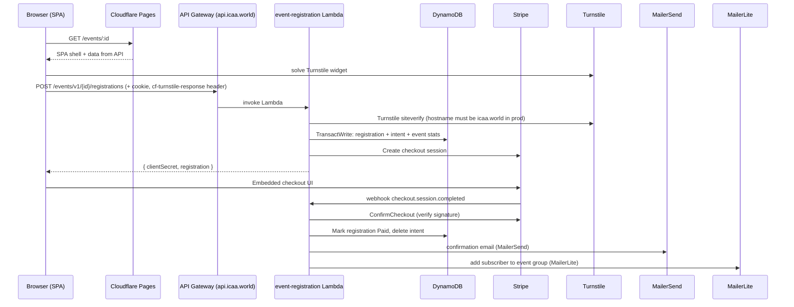

# System Architecture

## Overview

ICAA is a serverless platform:

- **A static React SPA** (`icaa.world`) served from Cloudflare Pages.
- **A family of small Go HTTP services**, each deployed as an AWS Lambda (container image) behind API Gateway and exposed on a single domain, `api.icaa.world`, at distinct path prefixes.
- **One data store per service** — DynamoDB (single-table design), plus S3 for uploaded assets and Stripe for any money motion.
- **A set of shared Go libraries** (`auth`, `middleware`, `captcha`, `email`, `payments`, `telemetry`) consumed by the services as semver-tagged modules.

There is no central monolith and no message bus. Each service owns its own DynamoDB table and never calls another service directly; coupling is limited to the shared auth cookies and external systems (Stripe, MailerLite, SES, Turnstile, Google).

```mermaid
flowchart TB
    Browser["<b>Browser</b>"] -->|"icaa.world"| Pages["Cloudflare Pages<br/>(React SPA, static)"]
    Browser -->|"api.icaa.world/&lt;prefix&gt;/*"| GW["AWS API Gateway<br/>(7 HTTP APIs → Lambda)"]
    Browser -->|"assets.icaa.world/&lt;uuid&gt;.&lt;ext&gt;"| S3[(S3<br/>assets.icaa.world)]

    subgraph AWS ["AWS us-east-1"]
        GW --> L_login["login Lambda<br/>/login"]
        GW --> L_articles["articles-api Lambda<br/>/articles"]
        GW --> L_assets["assets-api Lambda<br/>/assets"]
        GW --> L_donations["donation-api Lambda<br/>/donations"]
        GW --> L_events["event-registration Lambda<br/>/events"]
        GW --> L_ml["mailing-list-api Lambda<br/>/mailing-list"]
        GW --> L_voting["voting-api Lambda<br/>/voting"]

        L_login --> D_login[(DynamoDB login-api)]
        L_articles --> D_articles[(DynamoDB articles-api)]
        L_assets --> D_assets[(DynamoDB assets-api)]
        L_events --> D_events[(DynamoDB event-registration<br/>managed by Terraform)]
        L_voting --> D_voting[(DynamoDB voting-api)]
        L_assets --> S3
    end

    L_events -->|"checkout + webhook"| Stripe["Stripe"]
    L_donations -->|"checkout (embedded)"| Stripe
    L_events -->|"confirmation emails"| MailerSend["MailerSend"]
    L_events -->|"subscribers/groups"| MailerLite["MailerLite"]
    L_ml --> MailerLite
    L_events & L_ml & L_voting -->|"Turnstile siteverify"| Turnstile["Cloudflare Turnstile"]
    L_login -->|"ID token validation"| Google["Google OAuth"]
    L_login -->|"session"| Browser

    subgraph Obs ["Observability"]
        L_login & L_articles & L_assets & L_donations & L_events & L_ml & L_voting -->|"OTLP traces"| NR["New Relic"]
        Browser -->|"browser telemetry"| NR
    end
```

## Component layout

| Layer | Component | Notes |
|---|---|---|
| Edge | Cloudflare | DNS, CDN, Turnstile, Pages hosting |
| Frontend | `icaa.world` SPA | React, Vite, TanStack Query, openapi-fetch clients |
| Gateway | API Gateway HTTP API per service | Each Lambda registers an API mapping with a path key on `api.icaa.world` |
| Compute | Go Lambdas (Linux container, Lambda Web Adapter) | One function per service; ~128 MB, 10 s timeout |
| Data | DynamoDB (per service) | Single-table design (`PK`/`SK` + `GSI1`), TTL + optimistic locking |
| Assets | S3 `assets.icaa.world` | Public-read; write path is presigned POST |
| Payments | Stripe | Checkout sessions + webhook confirmation; donations data lives in Stripe |
| Email | MailerSend (send) / MailerLite (manage groups) | SES + Gmail also supported by the `email` lib |
| Auth | Google + `auth` lib | Google ID tokens in, ICAA HS256 JWT cookies out |
| Observability | OpenTelemetry → New Relic | `telemetry` lib wires Lambda-aware OTLP export |

## Typical request flow (event registration, paid)

## Guiding conventions

- **One service per concern**, small enough to run locally in a container; the frontend is the only consumer.
- **Single-table DynamoDB design** with `PK`/`SK`, a `GSI1` index for time-ordered listings, `Version` optimistic locking, and TTL for short-lived items.
- **OpenAPI-first**: each service declares `spec/api.yaml`, generates Go handlers with `oapi-codegen`, and serves its spec at `<prefix>/openapi.json` + Swagger UI.
- **Shared middleware & libs** instead of copy-paste: auth cookies, CORS, logging, tracing all come from `middleware`/`auth`/`telemetry`.
- **Public forms are bot-guarded** with Cloudflare Turnstile — token sent in the `cf-turnstile-response` header, hostname pinned to `icaa.world` in prod.

## Known quirks / sharp edges

- The `infra` Terraform declares `api.icaa.world` as an API Gateway **v1** domain + regional ACM cert, while all services publish through **HTTP API (v2)** mappings to the same hostname. It works, but the DNS/cert lineage of that domain isn't fully owned by this repo.
- `assets.icaa.world` DNS/cert for the S3 bucket is not managed in the `infra` Terraform either.
- `infra/README.md` is aspirational/stale (mentions an `icaa-api` gateway and a `terraform.tfvars.prod` that don't exist).
- No CI/CD pipeline deploys anything — builds/tests in CI, deploys are manual (`sam deploy`, `terraform apply`, wrangler).
- `donation-api` doesn't consume Stripe webhooks; payment completion is handled by the frontend and recorded in Stripe only. It still requires `/stripeEndpointSecret` at startup, so the secret sits there unused until/unless a webhook is added.