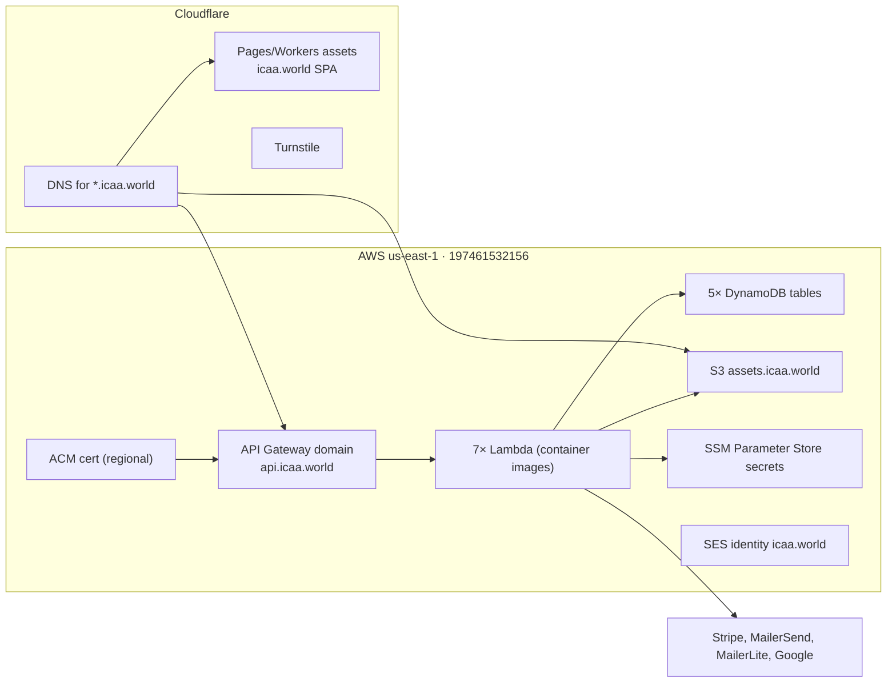

# Infrastructure, Deployment & Operations

## Cloud layout

### Roles of each layer

- **Cloudflare**: authoritative DNS for `icaa.world` (`api.icaa.world` → AWS, `assets.icaa.world` → S3), hosting of the SPA (Pages/Workers static assets, SPA fallback), Turnstile.
- **AWS API Gateway**: each SAM stack creates its own **HTTP API** (one Lambda per API) and an `AWS::ApiGatewayV2::ApiMapping` on `api.icaa.world` with a distinct path key (`/articles`, `/assets`, `/donations`, `/events`, `/login`, `/mailing-list`, `/voting`). Functions are `PackageType: Image` (x86_64), 128 MB, 10 s timeout, with a 30-day-retention Log Group.
- **AWS account**: single account (`197461532156`, `us-east-1`) for everything — Lambdas, DynamoDB, S3, SES, ACM, SSM. ECR holds the images (`sam build` → `sam deploy` pushes to per-function ECR repos).
- **New Relic**: all traces (Lambda via OTLP gRPC to `otlp.nr-data.net:4317` with the SSM license key; browser via the New Relic browser agent).

## What's in Terraform (`infra`, `managed-by=terraform`)

Small, shared resources; the per-service tables live in each service's SAM template instead.

- DynamoDB **`event-registration`** table (PITR, deletion protection) — the only Terraform-owned table.
- **`api.icaa.world`** API Gateway **v1** domain name + regional ACM certificate. (Services actually publish via HTTP-API **v2** mappings to the same hostname — the overlap is a known quirk, see [architecture.md](architecture.md).)
- SES domain identity for `icaa.world` + DKIM records (3 CNAMEs) and `_amazonses` TXT in Cloudflare.
- State in S3 `icaa-terraform-state` (`infrastructure/terraform.tfstate`, lockfile on).

## Deployment

**Nothing is auto-deployed.** CI (GitHub Actions) is build/test/lint only (`go build`, `go test`, `go generate`, `bun lint/build`); there are no deploy jobs, no workflow secrets, no environments in any repo.

| Asset | How it deploys | Notes |
|---|---|---|
| Backend services | `make build && sam deploy` (per repo) | Requires AWS creds; `samconfig.toml` per stack; `confirm_changeset=true`. |
| Terraform | `terraform apply` in `infra` | Needs the state bucket + Cloudflare API token. |
| Frontend | `bun run build` then publish `dist/` to Cloudflare Pages (wrangler project `icaa-world`, SPA fallback) | Wrangler deploy not checked in as a workflow. |

### SSM parameters (secrets)

Prod config isn't committed — services read SSM at startup: `/jwtSigningKeys`, `/adminEmails`, `/newrelic-license-key`, `/stripeSecretKey`, `/stripeEndpointSecret`, `/cfTurnstileSecretKey`, `/mailerLiteApiKey`, `/mailerSendApiKey`. Local dev uses `.env`/docker-compose defaults instead.

## Local development infrastructure

The `icaa.world` repo's `docker-compose.yml` runs on a shared Docker network `icaa-shared`:

- `dynamodb-local` (with the 5 production table schemas bootstrapped),
- `jaeger` (OTLP receiver, endpoints `jaeger:4317`/`4318`),
- `minio` (S3-compatible, bucket `icaa-assets`),
- plus `aws-cli`/`mc` setup containers.

Local API ports (SAM local): `events=3000, login=3001, assets=3002, donations=3003, articles=3004, mailing-list=3005, voting=3006`; frontend dev server `:5173`.

## Observability

- `telemetry.Init` configures an OTLP gRPC trace exporter (New Relic `api-key` header), Lambda-aware batch timeouts, global TracerProvider, and `TraceContext` propagator.
- `InstrumentAWSConfig` + `InstrumentedHTTPClient` give traces on all DynamoDB/SSM/S3/Stripe HTTP calls; services also use `FlushTraces` after each request.
- Access logging (`middleware.AccessLogging`) emits structured logs with request IDs and `CF-Connecting-IP` (fallback `X-Forwarded-For`) for client IP.
- Log Groups retain 30 days; traces go to New Relic (account `7969260`).

## Operational notes / gaps

- **No automated deployments** — deploys are manual and undocumented steps (a future improvement: a CD pipeline).
- **Turnstile hostname pinning**: in prod, registration/signup/voting tokens must come from `icaa.world` (rejected otherwise).
- The `infra` README is stale; treat this repo's docs as source of truth.
- Rate limiting / bot protection beyond Turnstile is not present.
- `icaa.world` also posts `/contact` to **Formspree** (a third-party form endpoint), not to a backend API.